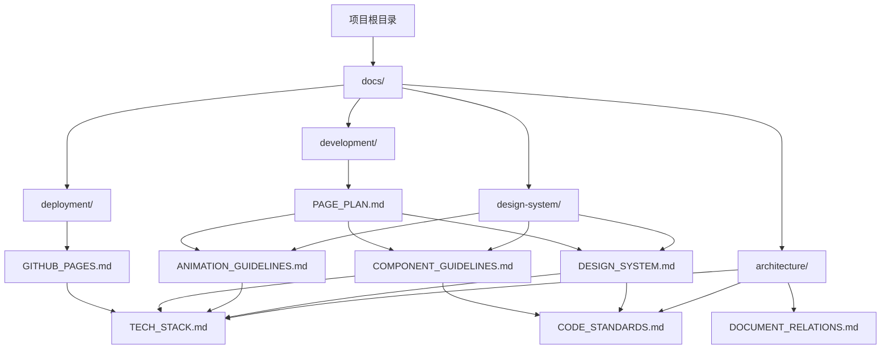

# 文档关系图

## 文档依赖关系

### 核心文档

- `DESIGN_SYSTEM.md`: 设计系统基础规范
- `ANIMATION_GUIDELINES.md`: 动画设计规范
- `COMPONENT_GUIDELINES.md`: 组件设计规范

### 开发文档

- `PAGE_PLAN.md`: 页面开发计划
- `TECH_STACK.md`: 技术栈说明
- `CODE_STANDARDS.md`: 代码规范

### 部署文档

- `GITHUB_PAGES.md`: GitHub Pages部署指南

## 开发时必要文件

1. 设计系统文档

   - `DESIGN_SYSTEM.md`
   - `ANIMATION_GUIDELINES.md`
   - `COMPONENT_GUIDELINES.md`

2. 开发规范文档

   - `TECH_STACK.md`
   - `CODE_STANDARDS.md`

3. 页面开发文档

   - `PAGE_PLAN.md`

4. 部署配置文档
   - `GITHUB_PAGES.md`

## 文档引用关系

1. 设计系统规范

   - 被引用：动画设计规范、组件设计规范
   - 引用：系统架构

2. 动画设计规范

   - 被引用：组件设计规范
   - 引用：设计系统规范

3. 组件设计规范

   - 被引用：系统架构
   - 引用：设计系统规范、动画设计规范

4. 系统架构

   - 被引用：API规范、部署指南
   - 引用：设计系统规范、组件设计规范

5. 数据流
   - 被引用：API规范
   - 引用：系统架构

## 文档更新影响

当更新某个文档时，需要检查以下文档是否需要同步更新：

1. 设计系统规范更新

   - 检查动画设计规范
   - 检查组件设计规范
   - 检查系统架构

2. 系统架构更新

   - 检查API规范
   - 检查部署指南
   - 检查数据流

3. 组件设计规范更新
   - 检查系统架构
   - 检查部署指南

## 文档维护建议

1. 定期检查文档间的引用关系
2. 更新文档时同步更新相关文档
3. 保持文档版本的一致性
4. 记录文档间的依赖关系变化
